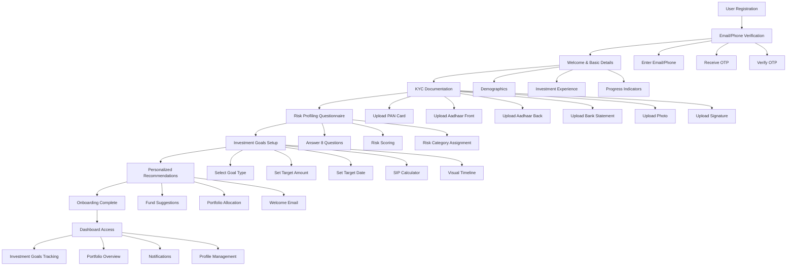

# User Journey Flowchart

## Decision Points

### 1. Registration Path
- **Email Registration**: User enters email → Receives verification email → Clicks verification link
- **Phone Registration**: User enters phone number → Receives SMS OTP → Enters OTP

### 2. KYC Document Upload
- **Document Quality**: Clear document → Proceed to next step | Blurry document → Request new upload
- **Document Type**: Valid document type → Accept | Invalid document type → Reject with reason

### 3. Risk Profiling
- **Conservative Profile**: Score 0-8 → Low-risk fund recommendations
- **Moderate Profile**: Score 9-16 → Balanced fund recommendations
- **Aggressive Profile**: Score 17-24 → High-growth fund recommendations

### 4. Investment Goals
- **Short-term Goals** (1-3 years): Debt and hybrid funds
- **Medium-term Goals** (3-7 years): Balanced and equity funds
- **Long-term Goals** (7+ years): Equity and ELSS funds

### 5. Fund Recommendations
- **Conservative Allocation**: 70% Debt, 30% Hybrid
- **Moderate Allocation**: 50% Equity, 30% Hybrid, 20% Debt
- **Aggressive Allocation**: 70% Equity, 20% Hybrid, 10% ELSS

## Edge Cases Handled

### 1. Incomplete Onboarding
- **Auto-save Progress**: User data saved at each step
- **Resume Later**: Users can return to last completed step
- **Session Timeout**: Automatic logout after inactivity

### 2. Document Verification Failures
- **Rejected Documents**: Clear rejection reasons provided
- **Resubmission**: Easy process to upload corrected documents
- **Support Request**: Option to contact support team

### 3. Risk Profile Mismatches
- **Profile Review**: Users can retake risk assessment
- **Advisor Consultation**: Option to speak with investment advisor
- **Profile Adjustment**: Manual adjustment of risk profile

### 4. Technical Issues
- **Offline Support**: Basic functionality available offline
- **Error Recovery**: Automatic recovery from common errors
- **Support Access**: Easy access to help and support

## User Experience Optimizations

### 1. Performance
- **Progressive Loading**: Load only necessary components
- **Caching**: Cache frequently accessed data
- **Optimized Assets**: Compressed images and assets

### 2. Accessibility
- **Keyboard Navigation**: Full keyboard support
- **Screen Reader**: ARIA labels and semantic HTML
- **Contrast Ratios**: WCAG compliant color schemes

### 3. Mobile Experience
- **Touch Targets**: Appropriately sized touch targets
- **Gestures**: Support for common mobile gestures
- **Orientation**: Works in both portrait and landscape

### 4. Feedback Mechanisms
- **Real-time Validation**: Immediate form validation
- **Loading States**: Clear loading indicators
- **Success Messages**: Confirmation of successful actions